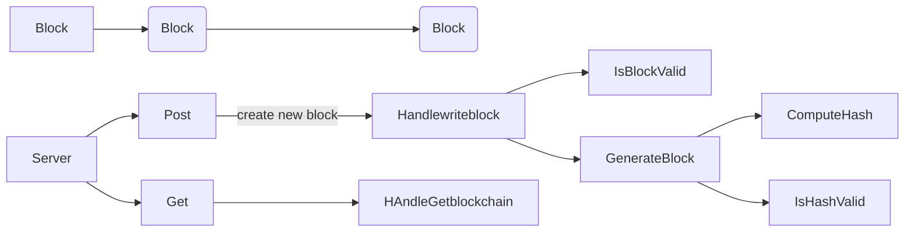

Based on https://www.youtube.com/watch?v=3_2ggnNplaw&list=PL5dTjWUk_cPYztKD7WxVFluHvpBNM28N9&index=45&ab_channel=AkhilSharma
and https://www.youtube.com/watch?v=5wzDhUB1mJk&ab_channel=AkhilSharma

https://github.com/AkhilSharma90/GO-Proof-Of-Stake-Blockchain

