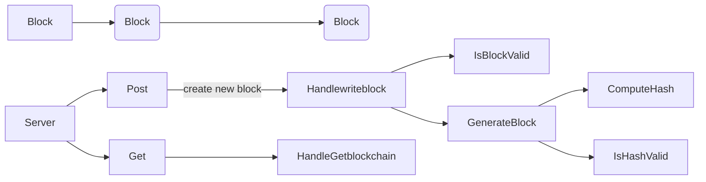

Based on https://www.youtube.com/watch?v=3_2ggnNplaw&list=PL5dTjWUk_cPYztKD7WxVFluHvpBNM28N9&index=45&ab_channel=AkhilSharma
and https://www.youtube.com/watch?v=5wzDhUB1mJk&ab_channel=AkhilSharma

https://github.com/AkhilSharma90/GO-Proof-Of-Stake-Blockchain

In this example, I have shown a very simple POW consensus mechanism.

Uses GO for the same.

To run -

go run main.go

Open http://localhost:8080 in a browser and you will see one block.

To add blocks, you send a POST request to localhost:8080 using CURL. Send a BPM like {"BPM":75} in the body of this post request.

`curl -X POST -H "Content-Type: application/json" -d '{"name": "75"}' http://localhost:8080`

Your terminal will start performing the work.